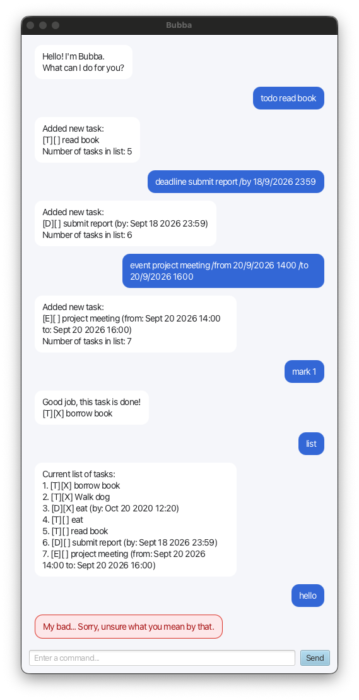

# Bubba User Guide

Bubba is a desktop task manager that keeps track of todos, deadlines, and events through a simple chat interface.



## Quick start

1. Install Java 25.
2. Download `bubba.jar` from the latest GitHub release.
3. Place the JAR in a folder where Bubba may create its `data` folder.
4. Open a terminal in that folder and run:

   ```bash
   java -jar bubba.jar
   ```

Bubba saves tasks automatically in `data/bubba.txt`, relative to the folder from which it is run.

## Command summary

| Action | Command |
|---|---|
| Show help | `help` |
| List tasks | `list` |
| Add a todo | `todo DESCRIPTION` |
| Add a deadline | `deadline DESCRIPTION /by DATE_TIME` |
| Add an event | `event DESCRIPTION /from DATE_TIME /to DATE_TIME` |
| Mark a task | `mark NUMBER` |
| Unmark a task | `unmark NUMBER` |
| Delete a task | `delete NUMBER` |
| Find tasks | `find KEYWORD` |
| Exit | `bye` |

`DATE_TIME` must use the format `d/M/yyyy HHmm`, such as `18/9/2026 2359`. Task numbers are shown by the `list` command.

## Viewing help

Enter `help` to display the supported commands inside Bubba.

## Adding tasks

### Todo

Use `todo` for a task without a date or time.

```text
todo read book
```

### Deadline

Use `deadline` for a task that must be completed by a specific date and time.

```text
deadline submit report /by 18/9/2026 2359
```

### Event

Use `event` for an activity with a start and end time. The end time must be later than the start time.

```text
event project meeting /from 20/9/2026 1400 /to 20/9/2026 1600
```

## Listing tasks

Enter `list` to display every saved task and its number.

```text
list
```

The symbols identify the task type and completion status:

- `[T]` — todo
- `[D]` — deadline
- `[E]` — event
- `[X]` — completed
- `[ ]` — incomplete

## Marking tasks

Use the number shown by `list` to mark or unmark a task.

```text
mark 2
unmark 2
```

## Finding tasks

Enter `find` followed by a word or phrase. Matching ignores letter case and preserves the order of the task list.

```text
find book
```

## Deleting tasks

Use the number shown by `list` to permanently remove a task.

```text
delete 1
```

## Exiting Bubba

Enter `bye` to close the application safely.

```text
bye
```

## Handling errors

Bubba highlights invalid commands in red and explains how to correct them. If a saved record is malformed, Bubba skips that record, shows a warning at startup, and continues loading the remaining tasks.
